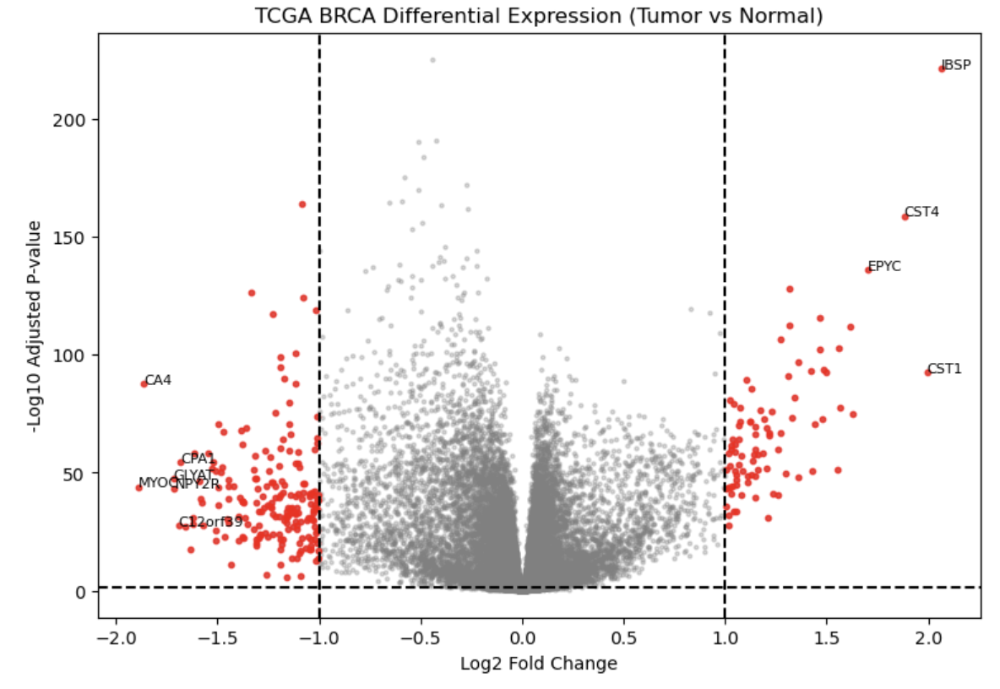
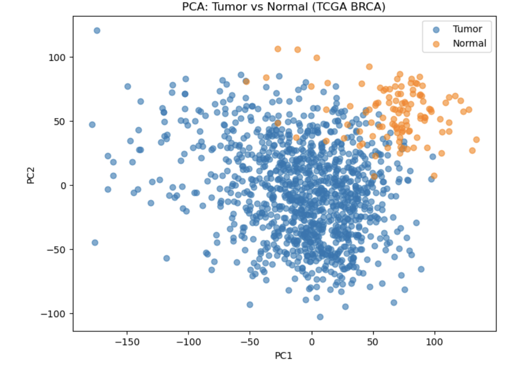
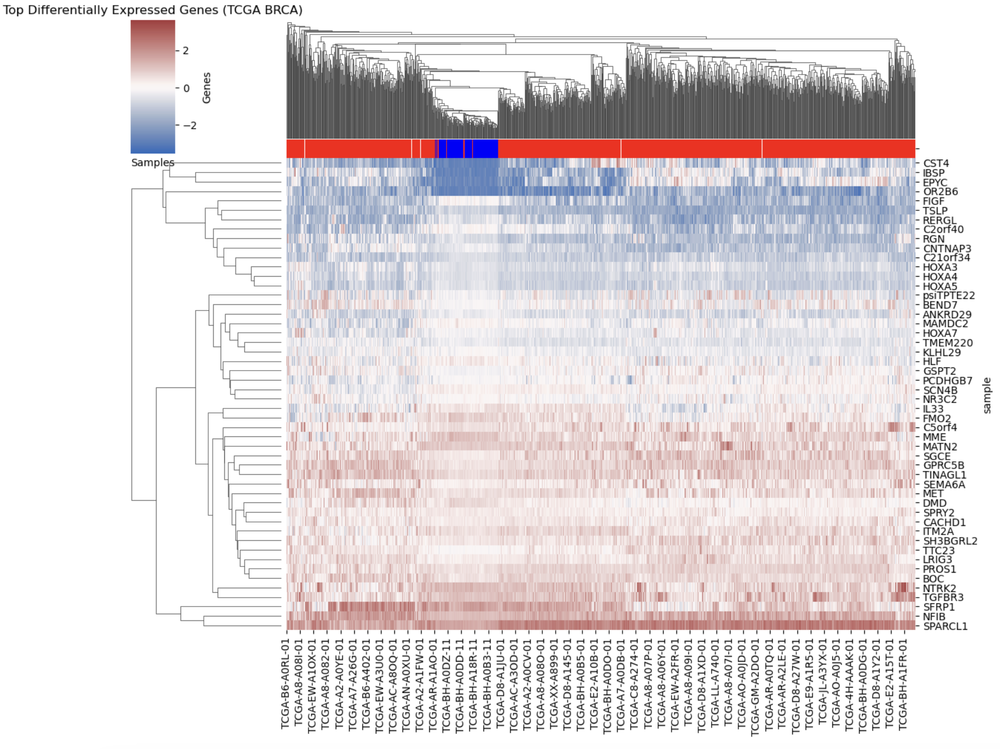

# TCGA Breast Cancer Gene Expression Analysis

## Overview
This project looks at RNA-seq gene expression data from TCGA breast cancer samples to see how tumor and normal tissue differ at the transcript level. I used Python to run differential expression analysis and then visualized the results with PCA and clustering to get a better sense of the overall structure in the data.

---
## Objectives
- Identify genes that are differentially expressed between tumor and normal samples  
- Visualize overall gene expression patterns using PCA  
- Explore how genes and samples cluster using a heatmap
  
---
## Methods
- Performed differential expression analysis using t-tests  
- Applied multiple testing correction using FDR (Benjamini–Hochberg)  
- Used PCA for dimensionality reduction  
- Generated a clustered heatmap to visualize gene expression patterns
  
---
## Results
### Differential Expression
The volcano plot shows a clear set of genes that are significantly up- or downregulated in tumor samples. Even with a simple statistical approach, there’s a noticeable shift in expression for certain genes, suggesting real biological differences between conditions.
### PCA
PCA shows partial separation between tumor and normal samples. It’s not perfectly clean (which is expected with biological data), but there’s definitely structure—tumor samples tend to group together more than with normals.
### Heatmap
The heatmap of the top differentially expressed genes shows clear clustering. Samples tend to group by condition, and genes with similar expression patterns cluster together, which points to coordinated regulation.

--
## Figures
### Volcano Plot

### PCA Plot

### Heatmap

---
## Technologies Used
- Python  
- pandas, numpy  
- matplotlib, seaborn  
- scikit-learn  
- statsmodels  

---
## Data Source
Gene expression data was obtained from the UCSC Xena Browser (TCGA BRCA dataset).

---
## Key Takeaways
- Tumor and normal samples show clear differences in gene expression  
- A relatively small set of genes accounts for most of the separation  
- PCA and clustering both capture meaningful biological structure in the data  

---
## Notes
This project uses a simplified differential expression approach (t-tests) rather than specialized RNA-seq tools. The goal was to build an intuitive and reproducible pipeline in Python while still capturing meaningful biological patterns.
